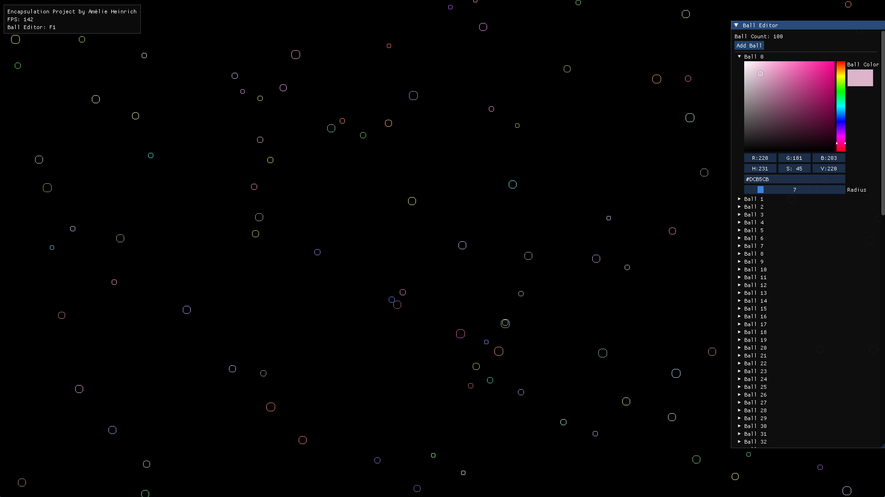

# Encapsulation : First Project of the GTech second year
The goal is to render bouncing balls that collide with each other, encapsulating the concept of a ball and other elements of the app.


## Notes
This project also has assignments (both theory and practice) about Object Oriented Programming. Their contents can be found in assignments/theory and assignments/practice respectively.

## Building

```
vcvarsall x64
build
```

You can then run the program using the run command.

## Dependencies

- [SDL2](https://www.libsdl.org/)
- [ImGui](https://github.com/ocornut/ImGui)

## Authors

- Amélie Heinrich (aheinrich@gaming.tech)
